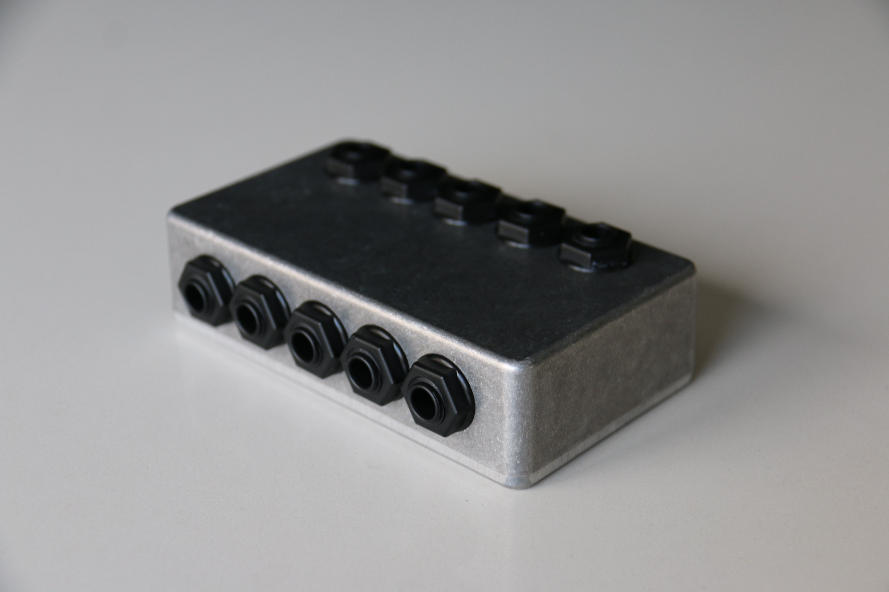

# 5 Way Patch Bay

## Components
The total cost is 21.13 €.

|   # |        Component | Unit Cost [€] | Number | Shipping Cost [€] | Total Cost [€] | Link | 
| --- | ---------------- | ------------- | ------ | ----------------- | -------------- | ---- |
|   1 | Neutrik NMJ2HF-S |          0.59 |     10 |              2.50 |           8.40 | [Thomann](https://www.thomann.de/be/neutrik_nmj2hf_s.htm) |
|   2 | Hammond 1550B    |          5.95 |      1 |              6.78 |          12.73 | [Tube-Town](https://www.tube-town.net/ttstore/hammond-diecast-1550b-115-x-64-x-26-mm.html) |
